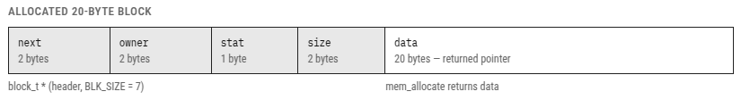
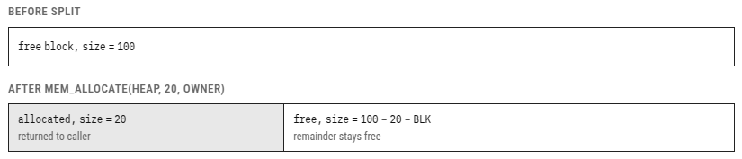
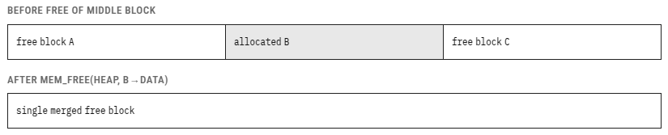

# Memory Management

*Yos* provides a simple heap allocator that supports multiple independent heaps, block splitting, block coalescing, and owner-based bulk release. The implementation is split over `kernel/mem_init.s`, `kernel/mem_allocate.s`, `kernel/mem_free.s`, `kernel/mem_free_owner.s` and the shared helper `kernel/_mem_payload_address.s`.

## Two Heaps

*Yos* maintains two separate heap areas:

| Symbol | Address | Size | Purpose |
|---|---|---|---|
| OS heap (`__sys_heap`, alias `__heap`) | `0x5F01` | to `0xBFFF` | every OS object, including threads, processes, stacks, timers, events, services, library tables and GPX state |
| user heap | `0xC000` | 16384 bytes in every configured bank | process/library images and public user allocations |

Both are declared in `startup/_kernel_memory.s` and initialised at the top of `main.s`:

```c
mem_init(__sys_heap, 0xc000 - (uint16_t)__sys_heap);
bank_init();
```

`__heap` is retained as a compatibility name for the same OS-heap root; it is
not a second common arena. The OS heap stops at the fixed banking boundary and
remains visible while any process or library bank is selected. Each bank is a
separate user heap using the same allocator and block format; see
[Banking](BANKING.md).

Having two separate heaps means OS allocations and user allocations never interfere with each other. A runaway user program that exhausts the user heap will not crash the kernel.

## The Block Header (`block_t`)

Every allocation is preceded by a 7-byte `block_t` header that the allocator uses to track the block's size, status, and owner:

```c
typedef struct block_s {
    sysobj_t hdr;       /* offset 0: next pointer, offset 2: owner */
    uint8_t  stat;      /* offset 4: bit 0 set = allocated, clear = free */
    uint16_t size;      /* offset 5: usable payload size in bytes */
    uint8_t  data[];    /* offset 7: payload begins here */
} block_t;
```

`BLK_SIZE` (7) is the size of the header; the assembly hard-codes it as the constant `7`.

In memory, an allocated 20-byte block looks like this. `block_t *` points
at the header; `mem_allocate` returns the payload (`data`):



| Offset | Field | Size | Notes |
|---|---|---|---|
| 0 | `next` | 2 bytes | Next block on the heap |
| 2 | `owner` | 2 bytes | Owning process or thread |
| 4 | `stat` | 1 byte | Free or allocated |
| 5 | `size` | 2 bytes | Payload size |
| 7 | `data` | 20 bytes | Returned pointer |

`mem_allocate` returns a pointer to `data`, not to the start of the `block_t`. `mem_free` recovers the `block_t` address by subtracting `BLK_SIZE` from the pointer it receives (`__mem_payload_address` does the opposite conversion).

The internal `__mem_split` helper divides a block while preserving its owner
and allocation flags in both fragments. It takes the retained prefix size and
splits only when that size fits and the remainder can carry a header and
payload (12 bytes or more); it returns carry set, with the block unchanged,
otherwise. Normal allocation calls it after its fit check.

`shrink_memory(memory, size)` in the public table (`kernel/_yos_shrink.s`)
builds on it: under a critical section it checks that the header at
`memory - 7` is allocated, splits the block at `size`, and frees the tail
through the normal `mem_free` coalescing path. The block never moves, and
when the tail is too small to form a block, or `size` is not smaller than the
block, the payload keeps its current length. A pointer whose header does not
read as allocated is rejected with `NULL`; there is no heap scan, so callers
must pass live `allocate_memory` results.

The image loader uses bank-selected equivalents of the same two operations:
`__image_retain` first shrinks
its read buffer to the relocated code end, releasing the consumed XL
relocation table, then splits the buffer at the compact exports/code
boundary. The original allocation now covers only the metadata prefix, and
the loader's ordinary final cleanup frees it through the unchanged buffer
pointer, so success and rollback share one release path. No allocator header
layout changes.

## Initialising a Heap

`mem_init` turns a raw memory region into a single large free block that the allocator can then subdivide:

```c
void mem_init(void *heap, uint16_t size);
```

```c
/* Example: initialise a 2048-byte heap at address 0xC000 */
mem_init((void *)0xC000, 2048);
```

After `mem_init`, the region contains one free `block_t` with `next = NULL`, `owner = NONE`, and `size = total_size - BLK_SIZE`.

## Allocating Memory

```c
void *mem_allocate(void *heap, uint16_t size, void *owner);
```

`mem_allocate` uses a **first-fit** strategy: it walks the linked list of blocks starting from `heap` and returns the first free block large enough to satisfy the request.

If the remainder can hold `BLK_SIZE + MIN_CHUNK_SIZE` = 11 bytes (a seven-byte
header plus at least four payload bytes), the allocator **splits** it:



The minimum chunk size (`MIN_CHUNK_SIZE = 4`) prevents creating free blocks so small they would be useless and just waste header space.

On success, `mem_allocate` returns a pointer to the payload. On failure (no block large enough), it returns `NULL`. **Always check the return value.**

```c
/* Allocate a 512-byte thread stack from the fixed OS heap. */
void *stack = mem_allocate(__sys_heap, 512, (void *)owner_thread);
if (!stack) {
    /* handle allocation failure */
}
```

Applications do not call `mem_allocate` directly. The `yos_t` table exposes
`allocate_memory(size)`, `free_memory(p)` and `shrink_memory(p, size)`. These
entries use three-byte `yos_user_ptr_t` far pointers. The
adapters (`kernel/_yos_malloc.s`, `kernel/_yos_free.s`, `kernel/_yos_shrink.s`)
scan the configured bank heaps in logical-bank order and assign the current
process as owner. During library initialization the temporary library owner
override is used instead; kernel-context allocations have owner `NONE`.
The adapters hold an IFF-preserving critical section across the complete heap
transaction. Raw `mem_allocate`, `mem_free`, and `mem_free_owner` are internal,
unprotected primitives; kernel callers must already hold the section whenever
an arena can be reached by another thread or interrupt callback.

## Freeing Memory

```c
void *mem_free(void *heap, void *p);
```

`mem_free` takes the pointer returned by `mem_allocate` (the `data` field), recovers the `block_t` header by subtracting `BLK_SIZE`, marks the block as free, and attempts to **coalesce** adjacent free blocks to prevent fragmentation.

The coalescing logic merges up to three blocks at a time:



Steps performed:
1. Mark B as free (`stat = 0`, `owner = NONE`).
2. If the *previous* block (A) is also free, merge A and B into one block.
3. If the *next* block (C) is also free, merge the result with C.

This coalescing keeps the heap from degenerating into many tiny unusable fragments over time.

`mem_free` returns the payload pointer of the freed block on success, or `NULL` if `p` was not found in the heap (a safety check against double-free or invalid pointers).

## Freeing by Owner

```c
uint8_t mem_free_owner(void *heap, void *owner);
```

`mem_free_owner` walks the heap and frees every allocated block whose `owner` field equals `owner`, restarting from the head after each match so coalescing cannot confuse the scan. It returns the number of blocks freed (modulo 256). This is how the scheduler reclaims a terminated thread's stack (`owner == thread_t *`) and how `process_reap` reclaims a process's loaded image and everything else it allocated (`owner == process_t *`) — see [Cleaning Up Resources](CLEANUP-RESOURCES.md).

## Heap Fragmentation

The ZX Spectrum has 64 KB of address space. Memory is precious. Keep these guidelines in mind:

- **Allocate once, keep long-lived objects alive.** Repeatedly allocating and freeing small blocks of varying sizes leads to fragmentation even with coalescing.
- **Use the OS heap for OS objects only.** `so_create`, thread stacks, service
  tables and other kernel-managed state allocate from the fixed
  `__sys_heap`/`__heap` arena. Program images and public application data use
  the banked user heaps. Never mix the two domains.
- **Thread stacks are freed when a thread exits** (as part of resource accounting). Do not free a stack manually.
- **Memory obtained through `yos->allocate_memory` is process-owned.** Free it
  explicitly when its useful lifetime ends; if it leaks, process reaping frees
  it. Library-initializer allocations follow the library's lifetime.
- **Loaded image code is bank-owned.** The loader scans the configured
  `0xC000-0xFFFF` arenas; process reaping releases an owner's blocks from
  every bank.
- **The minimum useful allocation is `MIN_CHUNK_SIZE = 4` bytes** of payload. Smaller requests will still be granted but the block cannot be split further.

## Usage Example: Custom Heap

You can create additional heaps anywhere in RAM. This is useful for isolating a subsystem's allocations:

```c
/* A dedicated 256-byte heap for scratch buffers (kernel-side code) */
uint8_t scratch_area[256];
mem_init(scratch_area, sizeof(scratch_area));

/* Allocate from it */
uint8_t *buf = mem_allocate(scratch_area, 64, NONE);

/* Free from it */
mem_free(scratch_area, buf);
```

The heap pointer (`scratch_area` in this example) must always be passed to every `mem_allocate` and `mem_free` call that belongs to that heap. Mixing up heap pointers will corrupt both heaps. The public `yos_t` table does not expose `mem_init`; custom heaps are a kernel-internal facility.
