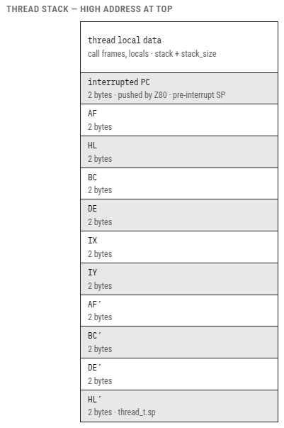

# Threads

A **thread** is an independent flow of execution. Multiple threads share
the same address space, but each keeps its own stack and its own set of
CPU registers. *Yos* implements preemptive, round-robin multithreading:
the 50 Hz hardware interrupt switches between runnable threads
automatically, with no cooperation required from the threads themselves.

## The thread structure

Every thread is a 39-byte `thread_t` object allocated on the kernel heap
(`__sys_heap`). The assembly modules address its fields through the
`.equ` offsets shown here:

```c
typedef struct thread_s {
    sysobj_t hdr;           /*  0: list link + owner (must be first) */
    uint16_t sp;            /*  5: saved stack pointer          THREAD_SP */
    uint8_t  startup[9];    /*  7: startup stub (see below) */
    uint8_t  load_error;    /* 16: saved loader status      THREAD_LOAD_ERROR */
    event_t  **wait;        /* 17: array of events to wait on   THREAD_WAIT */
    uint8_t  num_events;    /* 19: entries in wait[]            THREAD_NUM_EVENTS */
    uint8_t  state;         /* 20: current thread state         THREAD_STATE */
    int16_t  error_number;  /* 21: saved kernel errno       THREAD_ERRNO */
    void     *process;      /* 23: owning process               THREAD_PROCESS */
    uint8_t  bank;          // 25: exact mapped bank, FF = common thread
    uint8_t  call_depth;    // 26: active cross-bank call frames
    uint8_t  calls[12];     // 27: four bank/continuation frames
} thread_t;
```

Key points:

- **`sp`** — while a thread is not running, the CPU's stack pointer is
  saved here. When the scheduler switches back to this thread, it
  restores `SP` from this field.
- **`startup[9]`** — calls the entry function and jumps to `thread_exit`
  on return. The formerly unused tenth byte now holds loader status; the
  formerly reserved join word now holds kernel errno. Both error fields
  start at zero.
- **Error fields** — the scheduler saves the live public cells before
  running timer callbacks, and restores the next thread's values before
  returning. The register context itself stays 22 bytes.
- **Bank state** — the scheduler saves the exact mapped bank at
  preemption and restores it along with the context. Four fixed-memory
  far-call frames make nested library calls safe without shifting stack
  arguments.
- **`state`** — one of the values below.
- **`process`** — the thread's real process membership, used by cleanup.
  `hdr.owner` is normally the null far pointer `FFh:0000h`; library
  initialization temporarily places its library object there as an
  allocation/registration owner override, without ever changing real process
  membership.

## Thread states

A thread is always in exactly one of the following states:

| State constant | Value | Meaning |
|---|---|---|
| `STATE_SUSPENDED` | 0 | Created but not yet started, or explicitly paused |
| `STATE_RUNNING` | 1 | Eligible to run; the scheduler may pick it at any 50 Hz tick |
| `STATE_WAITING` | 2 | Blocked until one of its events is signalled |
| `STATE_JOINED` | 3 | Reserved; no kernel routine sets it |
| `STATE_TERMINATED` | 4 | Finished; resources not yet freed |

Four corresponding linked lists, plus the current-thread pointer, live in
`kernel/_thread_state.s`:

```c
thread_t *thread_current;
thread_t *thread_first_suspended;   /* SUSPENDED threads */
thread_t *thread_first_running;     /* RUNNING threads   */
thread_t *thread_first_waiting;     /* WAITING threads   */
thread_t *thread_first_terminated;  /* TERMINATED threads */
```

Moving a thread between two lists always goes through
`__thread_lswitch`, which takes the source and destination heads, the
thread, the new state byte, and an "immediate" flag. Inside a critical
section it unlinks the thread, stores the new state, re-links it, and — if
the flag is set — executes `HALT`, so the next interrupt reschedules
right away.

## Creating and starting a thread

```c
thread_t *thread_create(
    void (*entry_point)(),  /* function the thread will run */
    uint16_t stack_size,    /* stack size in bytes          */
    void *process           /* owning process (or NULL)     */
);
```

`thread_create` (`kernel/thread_create.s`) allocates both its `thread_t`
and a `stack_size` stack from the fixed OS heap (`__sys_heap`, also named
`__heap`), with the *thread* as the stack block's owner. It sets
`sp = stack + stack_size - CONTEXT_SIZE`, writes the startup stub, and
places the stub's address in the return-address slot of that initial
context. The thread starts out in the `SUSPENDED` state — it does not run
until `thread_resume` is called. If either allocation fails, everything
already done is rolled back.

```c
yos_t *yos = (yos_t *)query_service("yos");

/* Create a thread with a 512-byte stack, owned by this process */
yos_thread_t *t = yos->create_thread(my_function, 512, my_process);
if (!t) { /* handle allocation failure */ }

/* Move it to the RUNNING queue so the scheduler picks it up */
yos->resume_thread(t);
```

> **Stack size guidance.** 512 bytes is a reasonable minimum. Remember
> that each 50 Hz interrupt saves 22 bytes of register context on the
> thread's own stack, and that any function the thread calls pushes its
> own frame on top of that. `process_load` adds this 22-byte context to
> the stack size declared in an XPRG descriptor automatically;
> `create_thread` does not, so include it yourself when sizing a stack by
> hand.

## The startup stub

`_thread_prepare_startup` writes the nine-byte stub and clears the
loader status:

```
Offset  Bytes     Instruction
0       CD lo hi  CALL entry_point     ; call the user's function
3       21 lo hi  LD HL, <thread_t*>   ; thread pointer is the first argument
6       C3 lo hi  JP thread_exit       ; exit the thread (never returns)
9       00        initial loader status (not executed)
```

The first time the scheduler dispatches the thread, `RETI` at the end of
the context-restore path pops the stub's address as the "interrupted PC"
and lands in the stub. The stub calls `entry_point`. When `entry_point`
returns, the stub loads the thread pointer into `HL` — the `sdcccall(1)`
first argument — and jumps to `thread_exit`. **A thread function should
simply return when it is done**; there is no need to call `thread_exit`
manually.

## Context switching: how it works

The scheduler, `__thread_robin` (`kernel/_thread_robin.s`), is reached
through the IM2 vector at `0x5EFF` on every 50 Hz frame interrupt (see
[The Boot Process](BOOT.md)). Every 20 ms, the following sequence runs.

### Step 1 — save the current thread's context

The Z80's interrupt mechanism automatically pushes the interrupted PC
onto the stack. `__thread_robin` then pushes all remaining registers in
this order:

```
Pushed last → lower address (SP points here after save)
    HL'  DE'  BC'        ← alternate register set
    AF'                  ← alternate accumulator + flags
    IY   IX              ← index registers
    DE   BC   HL   AF    ← main register set
    [interrupted PC]     ← pushed automatically by the CPU
```

This block is exactly `CONTEXT_SIZE = 22` bytes. The current value of
`SP`, now pointing at the bottom of this block, is stored in
`thread_current->sp`. If `thread_current` is `NULL` — true only on the
very first interrupt, while the kernel is still in its idle loop —
nothing is saved.

### Step 2 — run pending timers

`__tmr_chain` fires any timer hooks whose countdown has reached zero (see
[Clock and Timers](CLOCK.md)).

### Step 3 — select the next thread

`__thread_select_next` (`kernel/_thread_select_next.s`) does three
things:

1. Calls `__thread_cleanup_terminated`, which frees the stack and object
   of every thread on the terminated list — except the one whose stack
   the interrupt is currently using — and reaps their processes; see
   [Cleaning Up Resources](CLEANUP-RESOURCES.md).
2. Walks the waiting list. A thread with a `YOS_EVENT_SET` event in its
   `wait[]` array consumes that signal (resetting it to zero) and moves
   back to the running list. One signal wakes exactly one waiter; repeated
   sets coalesce rather than accumulate.
3. Picks the next runnable thread: the successor of `thread_current` in
   the running list if `thread_current` is still `RUNNING` and has one,
   or otherwise the head of the running list, wrapping around.

If no thread is runnable, `__thread_robin` clears `thread_current`,
switches to the kernel stack, and idles with `EI; HALT`. The blocked
context stays untouched on its own stack. Later interrupts still run
timers and scan events, but they never restore a waiting or suspended
thread until it actually becomes runnable.

### Step 4 — restore the next thread's context

The new thread's `SP` is loaded from its `thread_t.sp` field, then every
register is popped in reverse order. `EI; RETI` pops the PC and
re-enables interrupts. The new thread resumes exactly where it left off —
or at its startup stub, the first time it runs. Before loading `SP`, the
scheduler maps the thread's saved logical bank unless it is `0xFF`, so a
thread interrupted inside a far library resumes with that library still
visible.

### Stack layout, visualised

High address is the stack bottom (`stack + stack_size`). The saved
context occupies 22 bytes below the pre-interrupt `SP`; `thread_t.sp`
points at `HL'`.



## Thread API

The kernel routines are `thread_create`, `thread_resume`,
`thread_suspend`, and `thread_exit`; the `yos_t` table exposes them as
`create_thread`, `resume_thread`, `suspend_thread`, and `exit_thread`.

### `thread_resume(t)`

Moves thread `t` from the `SUSPENDED` queue to the `RUNNING` queue
without yielding. Use this to start a newly created thread, or to unpause
one that was suspended earlier.

### `thread_suspend(t)`

Moves thread `t` from `RUNNING` to `SUSPENDED` and executes `HALT`, so
the next interrupt reschedules immediately. If `t` is the calling thread,
execution resumes after `thread_suspend` only once something else calls
`thread_resume` on it.

```c
/* Pause our own thread */
yos->suspend_thread(me);
/* When resumed, execution continues here */
```

### `thread_exit(t)`

Moves thread `t` to the `TERMINATED` queue and halts forever; the
scheduler reclaims the thread's stack and object on the next tick.
Normally reached through the startup stub when a thread's entry function
returns — you should not need to call this directly.

### `wait_event(event)`

Suspends the calling thread until the scheduler consumes a signal on
`event`. Call it through `yos->wait_event(event)` (slot 15, byte offset
30). It needs no thread handle and allocates nothing — the handle pushed
on the caller's stack forms the one-entry wait array.
`__thread_lswitch` publishes the `WAITING` state and queue under its
critical section, then halts for rescheduling.

A signal set before the call, or during publication, remains set for the
next scheduler scan. The scheduler clears it while interrupts are
disabled, immediately before moving one waiter to `RUNNING`. Calls to
`set_event(..., YOS_EVENT_SET)` are binary, so repeated signals never
accumulate work. `wait_event` itself returns no value. The saved array is
only ever examined while the thread is `WAITING`; each new wait replaces
it before publishing the thread on that queue.

Call `wait_event` with interrupts enabled, from a thread, outside any
critical section. Keep the event alive until every waiter and signal
producer has finished with it. Never call it from a timer hook, and never
destroy an event while a thread is waiting on it. There is still no
public multi-event wait, and no `thread_join`.

## Events

An event is a lightweight signalling object: a 6-byte system object whose
single payload byte holds `YOS_EVENT_RESET` (0) or `YOS_EVENT_SET` (1).

```c
/* Create an event (must be destroyed when no longer needed) */
yos_event_t *e = yos->create_event(owner);

/* Signal it (e.g. from a timer callback or interrupt handler) */
yos->set_event(e, YOS_EVENT_SET);

/* Block without receiving CPU time until one signal is consumed. */
yos->wait_event(e);

/* Explicitly cancel a pending signal if needed */
yos->set_event(e, YOS_EVENT_RESET);

/* Destroy when done */
yos->destroy_event(e);
```

`set_event` checks that `e` is actually on the event list before
writing, and returns `NULL` if it is not. Events owned by a process are
destroyed automatically when the process is reaped.

## A complete example

Thread creation needs the process handle that will own the new threads.
ABI 2 does not expose a current-process getter, so this helper is written
for a launcher that already has that handle — for example, the code that
called `create_process` in the first place:

```c
#include <yos.h>

static yos_t *yos;

/* Two independent threads draw to the screen */

void draw_left(void) {
    for (;;) { /* draw something on the left half */ }
}

void draw_right(void) {
    for (;;) { /* draw something on the right half */ }
}

void start_workers(yos_process_t *process) {
    yos = (yos_t *)query_service("yos");

    yos_thread_t *left  = yos->create_thread(draw_left,  512, process);
    yos_thread_t *right = yos->create_thread(draw_right, 512, process);

    if (left)  yos->resume_thread(left);
    if (right) yos->resume_thread(right);

    /* The workers now share this process and the 50 Hz scheduler. */
}
```

## Common pitfalls

**Stack overflow.** If a thread uses more stack than it was allocated, it
silently overwrites adjacent heap blocks — there are no guard pages.
Symptoms include corrupted data in apparently unrelated variables and
random crashes. When in doubt, increase `stack_size`.

**Shared data.** Multiple threads accessing the same global variable
without protection will race. Use `enter_critical_section()` and
`leave_critical_section()` to build a critical section around it:

```c
yos->enter_critical_section();
shared_counter++;   /* protected from interrupt-driven context switch */
yos->leave_critical_section();
```

**Long interrupt latency.** Holding interrupts disabled for more than a
few microseconds starves the scheduler and every timer callback. Keep
critical sections as short as you possibly can.

**Returning from a process's last thread.** The process itself is reaped
once its last thread terminates. `allocate_memory` records the current
process, and that memory is reclaimed at the same time; public timers,
however, remain kernel-owned and must still be destroyed explicitly.

**Do not free a thread's stack manually.** The OS frees it automatically
once the thread is cleaned up through ordinary resource accounting.
